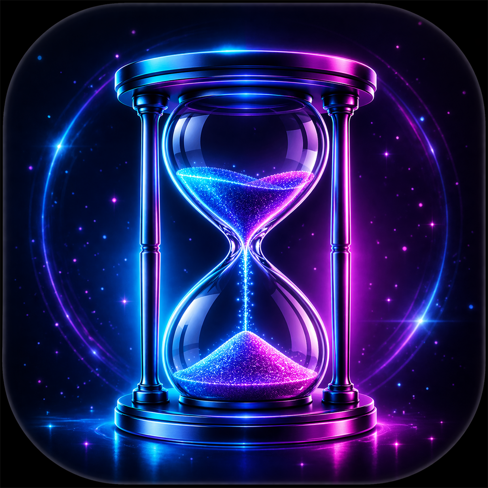

<div align="center">



# TimerWidget

**Transparent timer for presentations and desktop**

[](../../releases/latest)
[](https://www.electronjs.org/)
[](https://github.com/Jkaotlic/timer-widget/actions)
[]()
[](LICENSE)

[**Русский**](README.md) ·
[**Download**](../../releases/latest)

</div>

---

## Table of Contents

- [Features](#features)
- [Keyboard Shortcuts](#keyboard-shortcuts)
- [Installation](#installation)
- [For Developers](#for-developers)
- [Architecture](#architecture)
- [Security](#security)
- [FAQ](#faq)
- [Contributing](#contributing)
- [Changelog](#changelog)

---

## Features

<details open>
<summary><b>Timer</b></summary>

<br>

- 4 display styles — circle, digital LED, flip clock, analog
- Overtime with red pulsation and configurable limit
- 8 presets from 5 to 60 minutes
- `H:MM:SS` format when timer exceeds one hour
- Negative count with notifications every N minutes
- 30 built-in sounds (Web Audio API) + custom mp3/wav/ogg upload

</details>

<details>
<summary><b>4 Windows</b></summary>

<br>

| Window | Description |
|:-------|:------------|
| **Control Panel** | All settings across 4 tabs: Widget, Clock, Fullscreen, Sounds |
| **Widget** | Transparent, always-on-top mini-timer for the desktop |
| **Clock** | Independent clock with date and timezone |
| **Fullscreen** | For projectors or secondary monitors with display selection |

</details>

<details>
<summary><b>Customization</b></summary>

<br>

- Apple VisionOS glassmorphism — `blur(40px) saturate(180%)`
- Per-window color settings
- Gradient progress ring (#0a84ff → #30d158)
- Fullscreen background: solid color, gradient, image via URL or file
- Fonts: Inter Light for timer, JetBrains Mono for LED

</details>

<details>
<summary><b>Controls</b></summary>

<br>

- Keyboard shortcuts from **any** window (Space, R, 1-8, W, C, D)
- Scale slider 30–600% (widget, clock, fullscreen), **Ctrl+wheel** for quick scaling
- **Alt + drag** — freely reposition blocks on the fullscreen display
- All positions, scales, and settings persist between sessions
- Monitor selection for fullscreen mode

</details>

---

## Keyboard Shortcuts

All shortcuts work from **any** application window.

| Key | Action |
|:----|:-------|
| `Space` | Start / Pause |
| `R` | Reset |
| `1` `2` `3` `4` `5` `6` `7` `8` | Presets: 5, 10, 15, 20, 25, 30, 45, 60 min |
| `W` | Toggle widget |
| `C` | Toggle clock |
| `D` | Toggle fullscreen display |
| `Esc` | Close current window |
| `Ctrl` + wheel | Scale widget/clock/display |
| `Alt` + drag | Move block (fullscreen mode) |

---

## Installation

Download from [**Releases**](../../releases/latest):

| | Platform | File |
|:--|:---------|:-----|
|  | Windows | `TimerWidget-Setup.exe` — installer |
|  | Windows | `TimerWidget-Portable.exe` — portable |
|  | macOS Apple Silicon | `TimerWidget-arm64.dmg` |
|  | macOS Intel | `TimerWidget-x64.dmg` |

> **macOS**: The app is not signed with an Apple Developer certificate. On first launch:
> 1. Open the DMG and drag the app to Applications
> 2. **Right-click** TimerWidget → **Open** → confirm
>
> Or in Terminal: `xattr -cr /Applications/TimerWidget.app`

<details>
<summary>Linux</summary>

<br>

| | Format | File |
|:--|:-------|:-----|
|  | DEB | `TimerWidget-amd64.deb` |
|  | AppImage | `TimerWidget-x86_64.AppImage` |

</details>

---

## For Developers

```bash
git clone https://github.com/Jkaotlic/timer-widget.git
cd timer-widget
npm install
npm start
```

| Command | Description |
|:--------|:------------|
| `npm start` | Run the app |
| `npm run dev` | Run with DevTools |
| `npm test` | 70 tests (node --test) |
| `npm run lint` | ESLint 9 |
| `npm run ci` | Lint + tests |
| `npm run build:win` | Build for Windows (NSIS + Portable) |
| `npm run build:mac` | Build for macOS (DMG + ZIP) |

### Project Structure

```
timer-widget/
├── electron-main.js            # Main process — timer state, IPC
├── electron-control.html       # Control panel (4 tabs, ~5000 lines)
├── electron-widget.html        # Widget (transparent, frameless, always-on-top)
├── electron-clock-widget.html  # Clock (transparent, frameless, always-on-top)
├── display.html                # Fullscreen display (HTML)
├── display-script.js           # Fullscreen display (DisplayTimer logic)
├── preload.js                  # IPC bridge with channel whitelist
├── ipc-compat.js               # Compatibility shim ipcRenderer → electronAPI
├── constants.js                # Constants, IPC channels, storage keys
├── utils.js                    # formatTime, parseTime, debounce, safelySendToWindow
├── security.js                 # Validation: URL, DataURL, images, escapeHTML
├── channel-validator.js        # IPC channel whitelist (mirrored in preload.js)
└── tests/                      # 70 tests (9 files)
```

---

## Architecture

```
┌─────────────────┐          ┌──────────────────────────┐
│  Control Panel   │◄────────►│                          │
│  (settings, UI)  │   IPC    │     electron-main.js     │
├─────────────────┤          │                          │
│  Widget          │◄────────►│  - Timer state (truth)   │
│  (transparent)   │          │  - Window management     │
├─────────────────┤          │  - IPC routing            │
│  Clock           │◄────────►│                          │
│  (transparent)   │          │     preload.js            │
├─────────────────┤          │  - Channel whitelist      │
│  Display         │◄────────►│  - Direction validation   │
│  (fullscreen)    │          └──────────────────────────┘
└─────────────────┘
```

**Key principles:**

- **Main process is the single source of truth.** The timer ticks only in main; all windows receive state via `timer-state` every second
- **Per-window IPC channels.** Colors, styles, and settings are sent to specific windows (`widget-colors-update`, `clock-colors-update`, `display-colors-update`) — never broadcast globally
- **Monotonic synchronization.** `updateCounter` guarantees update ordering without relying on system clocks
- **Context isolation + sandbox** on all windows. Renderers have no access to Node.js APIs

---

## Security

<details>
<summary>Security measures in detail</summary>

<br>

- `nodeIntegration: false`, `contextIsolation: true`, `sandbox: true` on all windows
- IPC whitelist with direction validation (send / receive) in `preload.js` and `channel-validator.js`
- `hardenWindow()` blocks navigation to non-file:// URLs and denies `window.open`
- Numeric inputs: validation for `NaN`, `Infinity`, min/max bounds
- Images: MIME type + magic bytes validation (WebP checks RIFF+WEBP signature)
- SVG blocked in data URLs (XSS vector)
- CSS injection: colors validated via regex, URLs checked with `URL()` constructor
- Audio: empty `file.type` is rejected

</details>

---

## FAQ

<details>
<summary><b>How do I change the widget scale?</b></summary>

Use the slider at the bottom of the window (30–600%) or `Ctrl+mouse wheel`. Double-click the slider to reset to 100%. Works on the widget, clock, and fullscreen display.

</details>

<details>
<summary><b>How do I show the timer on a second monitor?</b></summary>

Press `D` or go to the "Fullscreen" settings tab → select the desired monitor from the list.

</details>

<details>
<summary><b>The timer shows negative time?</b></summary>

That's Overtime mode — the timer keeps counting past zero. Configure it in the control panel: overtime limit and notification interval. Press `R` to reset.

</details>

<details>
<summary><b>Can I add a custom sound?</b></summary>

Yes. Go to the "Sounds" tab → upload an mp3, wav, or ogg file. Assign it to any event (start, one-minute warning, finish, overtime).

</details>

<details>
<summary><b>Does it work offline?</b></summary>

Yes, fully offline. All sounds are synthesized via Web Audio API; fonts are cached after the first load.

</details>

<details>
<summary><b>How do I move blocks on the fullscreen display?</b></summary>

Hold `Alt` and drag any info block (time, status, current time) to the desired position. Positions persist between sessions.

</details>

---

## Contributing

1. Fork the repository
2. Create a branch (`git checkout -b feature/my-feature`)
3. Make sure tests and linting pass: `npm run ci`
4. Create a Pull Request

Bugs and suggestions — in [Issues](../../issues).

---

## Changelog

### v2.0.0

- Apple VisionOS glassmorphism — full redesign of all windows
- 4 timer styles across all windows (circle, LED, flip, analog)
- Ctrl+slider scaling 30–600%
- Alt+drag block repositioning on fullscreen display
- Global keyboard shortcuts from any window
- 30 built-in sounds via Web Audio API
- Per-window color and style settings
- Overtime with pulsation and H:MM:SS format

[All releases →](../../releases)

---

<div align="center">

**Electron 41** · **Node.js 22** · **Vanilla JS** · **Web Audio API** · **70 tests** · **GitHub Actions CI**

MIT © 2024–2026 [Jkaotlic](https://github.com/Jkaotlic)

[](../../stargazers)
</div>
