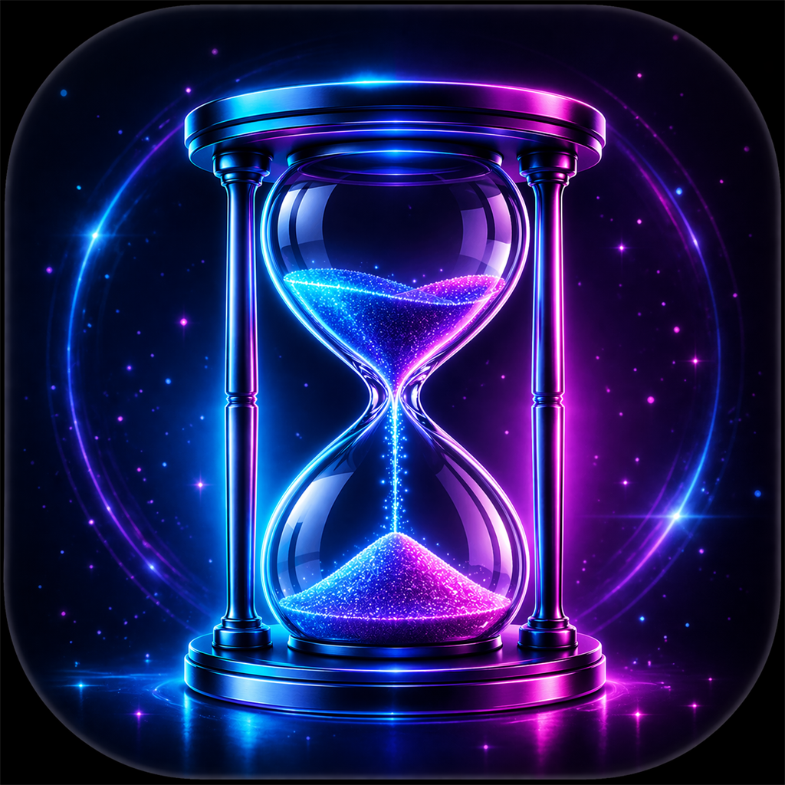

<div align="center">



# TimerWidget

**Transparent timer widget for presentations and desktop**

[](../../releases/latest)
[](https://www.electronjs.org/)
[](https://github.com/Jkaotlic/timer-widget/actions)
[](tests/)
[]()
[](LICENSE)

[**Русский**](README.md) ·
[**Download**](../../releases/latest) ·
[**Changelog**](CHANGELOG.md)

</div>

---

## Table of Contents

- [Features](#features)
- [Keyboard Shortcuts](#keyboard-shortcuts)
- [Installation](#installation)
- [For Developers](#for-developers)
- [Architecture](#architecture)
- [Security](#security)
- [FAQ](#faq)
- [Contributing](#contributing)

---

## Features

<details open>
<summary><b>Timer</b></summary>

<br>

- 4 display styles — **Circle**, **Flip** (split-flap leaves), **Analog** (hands), **Digits**
- Overtime with red pulsation, configurable limit and notification interval
- 4 time presets — 5, 15, 25, 45 minutes — + manual input (`sec`, `min:sec`, `hr:min:sec`)
- `H:MM:SS` format automatically when timer exceeds one hour
- Negative count with notifications every N minutes
- 32 built-in sounds (Web Audio API, synthesised from oscillators — the package ships no audio files) + custom `.mp3` / `.wav` / `.ogg` / `.flac` / `.webm` / `.aac` upload, up to 5 MB
- Each of the four events gets its own sound: start, zero, final minute, overrun

</details>

<details>
<summary><b>4 windows</b></summary>

<br>

| Window | Description |
|:-------|:------------|
| **Control Panel** | Compact 400×740 (380 minimum) with a slide-out settings drawer. Four tabs: Widget, Clock, Display, Sounds. Collapses to a narrow bar with `M` — start, pause and reset only |
| **Widget** | Transparent, always-on-top mini timer for desktop |
| **Clock** | Independent clock with date and timezone, 4 style variants |
| **Fullscreen** | For projectors or secondary monitors. Display picker, Alt-drag for blocks and for the timer itself, windowed-mode toggle |

</details>

<details>
<summary><b>Design</b></summary>

<br>

- Flat, opaque surfaces — no blur, no outer glows: on a projector and in screen capture they smear the digits
- **Two themes** — dark and light, shared across all four windows
- A window's palette follows the BRIGHTNESS of its background, not the theme: on a light fill the text darkens by itself
- 6 fonts to choose from for the **Digits** style — all local, the app never fetches them
- **HSV color picker** per window — full color control, not just presets
- Gradient progress ring (systemBlue `#0a84ff` → systemGreen `#30d158`)
- Apple semantic palette: `#0a84ff` / `#30d158` / `#ff453a` / `#ff9f0a`
- Fullscreen background — solid fill, gradient, or local file (`.png`, `.jpg`, `.webp` with magic-bytes validation)
- The widget and the clock get their own background too, each with its own opacity

</details>

<details>
<summary><b>Controls</b></summary>

<br>

- Keyboard shortcuts work from **any** window (Space, R, 1–4, W, C, D)
- **Ctrl + wheel** — scale widget / clock / display (30–600%)
- **Shift + wheel** — separate scaling for info blocks on fullscreen
- **Alt + drag** — freely move blocks and the timer itself on the fullscreen display
- **Click the scale percentage** — exact input, double-click resets to 100%
- All positions, scales and settings persist between sessions
- Monitor picker for fullscreen mode

</details>

<details>
<summary><b>Fullscreen display: blocks and layouts</b></summary>

<br>

Seven movable elements live around the timer: current time, start, end, time
left, event title, the caption under the timer and the status pill. Each has its
own toggle, is dragged with `Alt` and scales with `Shift` + wheel **independently
of the others**.

**Five ready-made layouts** place everything at once — one button, no manual
dragging:

| Layout | For what |
|:-------|:---------|
| **Classic** | Timer in the centre, times in the corners |
| **Meeting** | Title on top, four time blocks in the corners |
| **Stage** | One large timer, nothing else |
| **Summary** | All time blocks in a row along the bottom |
| **Minimum** | The timer alone, no captions or blocks |

A layout describes the **whole** screen: whatever it does not list, it turns off —
so switching never leaves leftovers from the previous one.

An element's position is stored as a **fraction of the window** rather than a
pixel, and sizes are derived from the content band — the composition carries
across monitors of different resolution and aspect ratio without hand-fixing.

Any block's caption can be renamed in its own field; an empty field restores the
default word.

</details>

<details>
<summary><b>Look presets and the position lock</b></summary>

<br>

**Look presets** — four slots labelled «ВИД» at the bottom of the control
panel. A slot holds the ENTIRE look: styles of all three windows, which display
blocks are on and where they sit, the layout, colours, fonts, scales, the
background, the event time and title.

| Action | What happens |
|:-------|:-------------|
| Click an **empty** slot | Store the current look |
| Click a **filled** slot | Apply the stored look |
| **Shift + click** | Overwrite the slot with the current look |
| **Ctrl + 1…4** | The same from the keyboard — works from the fullscreen window too |
| **1 2 3 4** (no Ctrl) | Still TIME presets — 5, 15, 25, 45 min |

A filled slot is tinted and bold, an empty one is just an outline.

Deliberately NOT in a preset: the background image (megabytes — four slots would
blow the storage quota), the on-screen position and size of the widget and clock
windows, and the timer duration — a preset owns the look, not the run.

**Position lock** — the 🔓 / 🔒 button in the panel titlebar, next to the theme
switch. Once everything is set up, the lock cancels the gestures that can move
the composition by accident:

- dragging blocks on the fullscreen display (Alt) and the widget/clock windows;
- `Ctrl` + wheel and `Shift` + wheel (scaling);
- the close cross on a block.

Settings keep working: everything is still configurable from the panel. The lock
is shared by all windows and survives a restart.

</details>

---

## Keyboard Shortcuts

Work from **any** window.

| Key | Action |
|:----|:-------|
| `Space` | Start / Pause |
| `S` | Pause |
| `R` | Reset to the original value |
| `1` `2` `3` `4` | TIME presets: 5, 15, 25, 45 min |
| `5` | Custom time — manual input |
| `Ctrl` + `1`…`4` | LOOK presets: apply a slot (`Ctrl` + `Shift` + `1`…`4` stores it) |
| `W` | Toggle widget |
| `C` | Toggle clock |
| `D` | Toggle fullscreen |
| `Z` | Toggle sound |
| `M` | Collapse the panel to a bar and back |
| `F1` | Keyboard cheat sheet |
| `Esc` | Close settings, modal or help. Does NOT close windows |
| `Ctrl` + wheel | Scale widget / clock / fullscreen |
| `Shift` + wheel | Scale info blocks on fullscreen |
| `Alt` + drag | Move an info block — or the timer itself — on fullscreen |

Scaling and dragging gestures are disabled by the position lock (the 🔒 button
in the panel titlebar).

---

## Installation

Download from [**Releases**](../../releases/latest):

| | Platform | File |
|:--|:---------|:-----|
|  | Windows | `TimerWidget-Setup-*.exe` — installer (NSIS) |
|  | Windows | `TimerWidget-Portable.exe` — no install needed |
|  | macOS Apple Silicon | `TimerWidget-*-arm64.dmg` |
|  | macOS Intel | `TimerWidget-*-x64.dmg` |

> **macOS**: the app is not signed with an Apple Developer certificate. On first launch:
> 1. Open the DMG and drag the app into Applications
> 2. **Right-click** TimerWidget → **Open** → confirm
>
> Or from terminal: `xattr -cr /Applications/TimerWidget.app`

<details>
<summary>Linux</summary>

<br>

| | Format | File |
|:--|:-------|:-----|
|  | DEB | `TimerWidget-*-amd64.deb` |
|  | AppImage | `TimerWidget-*.AppImage` |

`chrome-sandbox` is installed without the SUID bit (0755); the app runs with `--no-sandbox`, so user namespaces are not required.

</details>

---

## For Developers

```bash
git clone https://github.com/Jkaotlic/timer-widget.git
cd timer-widget
npm install
npm start
```

| Command | Description |
|:--------|:------------|
| `npm start` | Run the app |
| `npm run dev` | Run with DevTools |
| `npm test` | Tests (`node --test`) |
| `npm run lint` | ESLint 9 (flat config) |
| `npm run ci` | Lint + tests |
| `npm run screenshot` | 24 PNG screenshots for headless visual review |
| `npm run build:win` | Build Windows (NSIS + Portable) |
| `npm run build:mac` | Build macOS (DMG + ZIP, arm64 + x64) |
| `npm run build` | Build for current platform |

### Project Structure

```
timer-widget/
├── electron-main.js            # Main process — timer state, IPC, windows
├── electron-control.html       # Control panel (4 tabs + drawer)
├── electron-widget.html        # Widget (transparent, frameless, always-on-top)
├── electron-clock-widget.html  # Clock (transparent, frameless, always-on-top)
├── display.html                # Fullscreen mode (HTML)
├── display-script.js           # Fullscreen mode (DisplayTimer logic)
├── timer-engine.js             # Pure timer logic (testable)
├── recovery.js                 # State recovery after crash
├── preload.js                  # IPC bridge with channel whitelist
├── ipc-compat.js               # ipcRenderer → electronAPI shim
├── channel-validator.js        # IPC channel whitelist
├── constants.js                # Constants, IPC channels, storage keys
├── utils.js                    # formatTime, parseTime, debounce, safelySendToWindow
├── security.js                 # Validation: data URL, images, escapeHTML
├── fonts.css                   # Local @font-face declarations — one copy for all windows
├── design-tokens.css           # CSS custom properties (palette, shadows, blurs, timings)
├── control.css                 # Control panel styles
├── build/
│   ├── icon.png                # App icon (1024×1024)
│   ├── after-pack.js           # electron-builder hook
│   └── linux-after-install.sh  # chmod 0755 chrome-sandbox without SUID
├── scripts/
│   ├── run-electron.js         # Wrapper: clears ELECTRON_RUN_AS_NODE
│   └── screenshot-runner.js    # Headless harness for visual review
└── tests/                      # unit tests (node --test)
```

---

## Architecture

```
┌─────────────────┐          ┌──────────────────────────┐
│  Control Panel   │◄────────►│                          │
│  (settings, UI)  │   IPC    │     electron-main.js     │
├─────────────────┤          │                          │
│  Widget          │◄────────►│  - Timer state (truth)   │
│  (transparent)   │          │  - Window management     │
├─────────────────┤          │  - IPC routing            │
│  Clock           │◄────────►│                          │
│  (transparent)   │          │     preload.js           │
├─────────────────┤          │  - Channel whitelist     │
│  Display         │◄────────►│  - Direction validation  │
│  (fullscreen)    │          └──────────────────────────┘
└─────────────────┘
```

**Key principles:**

- **Main process is the single source of truth.** The timer ticks only in main; all windows receive state via `timer-state` every second
- **Per-window IPC channels.** Colors, styles and settings are sent to specific windows (`widget-colors-update`, `clock-colors-update`, `display-colors-update`) instead of globally — prevents "color bleeding" between windows
- **Monotonic synchronization.** `updateCounter` guarantees ordered updates without depending on system clocks
- **Context isolation + sandbox** on all windows. Renderers have no access to Node.js APIs
- **DevTools disabled** in all production windows (`devTools: false`)

---

## Security

<details>
<summary>Security measures in detail</summary>

<br>

- `nodeIntegration: false`, `contextIsolation: true`, `sandbox: true` on all windows
- `devTools: false` — developer console unavailable in production
- IPC whitelist with direction validation (send / receive) in `preload.js` and `channel-validator.js`
- `hardenWindow()` blocks navigation to non-file:// URLs and denies `window.open`
- **No HTTP/HTTPS loading.** Background images are accepted only as local `data:` URLs
- Numeric IPC inputs: checks for `NaN`, `Infinity`, min/max bounds
- Images: MIME + magic-bytes validation (WebP checks RIFF+WEBP signature, ≤10 MB)
- Audio: MIME + magic bytes for MP3 / WAV / OGG / FLAC / WebM / AAC, ≤5 MB
- SVG blocked in data URLs (XSS vector)
- CSS injection: colors validated via regex, URLs parsed via `URL()` constructor
- Chromium Component Updater disabled (`disable-component-update` + `disable-features=ChromeVariations,OptimizationHints`) — the app never calls home
- electron-builder `afterPack` strips external political content from `LICENSES.chromium.html`
- On Linux, `chrome-sandbox` is installed without the SUID bit (0755)

</details>

---

## FAQ

<details>
<summary><b>How do I change widget scale?</b></summary>

`Ctrl + mouse wheel` — quick scaling (30–600%). Click the percentage number — type an exact value. Double-click — reset to 100%. Works on widget, clock and fullscreen.

</details>

<details>
<summary><b>How do I send the timer to a second monitor?</b></summary>

Press `D` or open the Fullscreen tab → pick the monitor from the list. The choice persists — next time fullscreen opens on the same display.

</details>

<details>
<summary><b>Why is the timer showing negative time?</b></summary>

That's Overtime mode — the timer keeps counting past zero. Configurable in the control panel: overtime limit and notification interval. `R` to reset.

</details>

<details>
<summary><b>Can I add my own sound?</b></summary>

Yes. Sounds tab → upload `.mp3`, `.wav`, `.ogg`, `.flac`, `.webm` or `.aac` up to 5 MB. Assign it to any event (start, minute tick, finish, overtime).

</details>

<details>
<summary><b>Does it work offline?</b></summary>

Yes, fully offline. All fonts are bundled locally (`fonts/`), sounds are synthesized via Web Audio API, and Chromium's Component Updater is disabled — the app never touches the network.

</details>

<details>
<summary><b>How do I move blocks on fullscreen?</b></summary>

Hold `Alt` and drag any info block (time, status, current time) to the desired position. Positions persist in localStorage between sessions.

</details>

<details>
<summary><b>Why is the control panel so narrow?</b></summary>

In v2.3 the panel became compact (380 px); settings moved into a **drawer** — a slide-out side panel. Clicking the gear icon or any tab expands the drawer next to the panel, like a macOS Finder detail pane. Closing the drawer returns the panel to its compact size.

</details>

---

## Contributing

1. Fork the repository
2. Create a branch (`git checkout -b feature/my-feature`)
3. Make sure `npm run ci` passes (lint + tests)
4. Open a Pull Request

Bugs and feature requests — in [Issues](../../issues). Full change history — in [CHANGELOG.md](CHANGELOG.md).

---

<div align="center">

**Electron 43.2.0** · **Vanilla JS** · **Web Audio API** · **node --test** · **GitHub Actions CI**

MIT © 2024–2026 [Jkaotlic](https://github.com/Jkaotlic)

[](../../stargazers)
</div>
